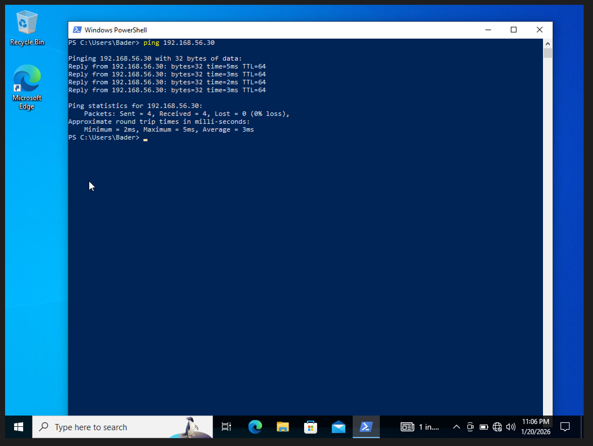
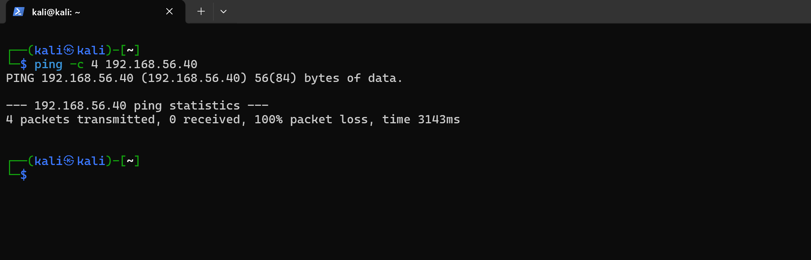

# Baseline Security Posture

Documented the default network security posture of the Windows endpoint before introducing any exposure. This establishes what traffic is permitted or denied out of the box, creating a reference point for all subsequent changes.

## Environment

| System  | Role     | IP Address     |
|---------|----------|----------------|
| Kali VM | Attacker | 192.168.56.10  |
| Win VM  | Target   | 192.168.56.40  |

Both systems on the same VirtualBox Host-Only subnet (`192.168.56.0/24`).

---

## Baseline Checks

### 1. Neighbor Discovery

Enumerated local network neighbors from Kali to confirm the Windows endpoint is reachable at Layer 2:

### 2. Outbound Connectivity (Windows → Kali)

Pinged Kali from the Windows endpoint — ICMP replies received successfully. Outbound traffic is permitted by default.

### 3. Inbound Connectivity (Kali → Windows)

Pinged the Windows endpoint from Kali — all requests failed. Inbound traffic is blocked by default.

### 4. Firewall Verification

Confirmed Windows Defender Firewall is enabled with inbound connections blocked unless explicitly allowed:

### 5. ICMP Rule Inspection

Inbound ICMPv4 Echo Request rules (under File and Printer Sharing) are disabled by default — confirming why Kali's pings were dropped:

---

## Findings

| Check | Result |
|-------|--------|
| Windows Firewall | Enabled, enforcing policy |
| Inbound traffic | Denied by default |
| Inbound ICMP | Blocked (rules disabled) |
| Outbound traffic | Permitted |
| External discoverability | None via ICMP |

The endpoint has a secure default posture — not exposed to unsolicited inbound traffic. Any future change in reachability can be directly attributed to deliberate configuration, not default behavior.
