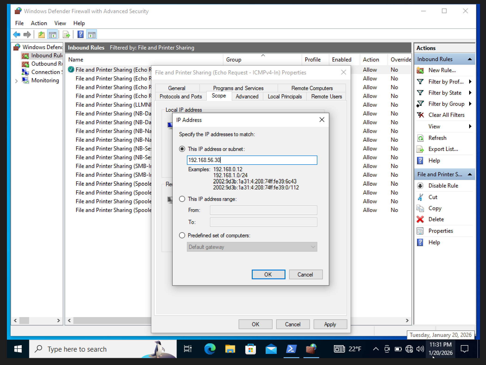
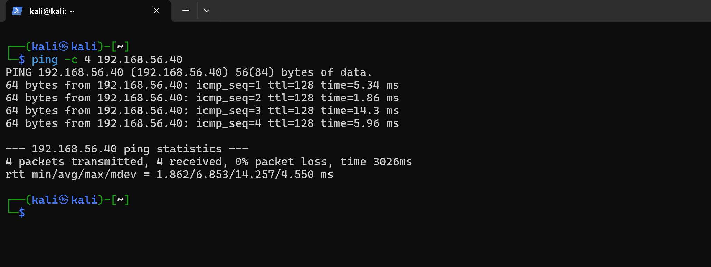
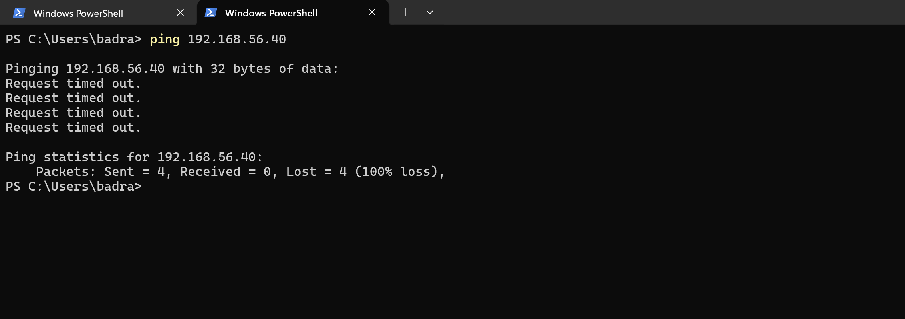

# Controlled Exposure (ICMP)

Introduced a scoped inbound firewall rule on the Windows endpoint to allow ICMP from a single authorized source while keeping everything else blocked. This validates that Windows Defender Firewall enforces source-level access control before exposing any real services.

## Environment

| System      | Role                | IP Address     |
|-------------|---------------------|----------------|
| Kali VM     | Authorized attacker | 192.168.56.10  |
| Win VM      | Target              | 192.168.56.40  |
| Host machine | Unauthorized source | 192.168.56.1   |

Starting point: Phase 01 confirmed all inbound ICMP was blocked by default.

---

## Firewall Changes

### 1. Enable ICMPv4 Inbound Rule

Enabled the existing **Echo Request — ICMPv4-In** rule under the File and Printer Sharing rule group.

### 2. Scope to Kali Only

Restricted the rule to accept ICMP echo requests **only** from the Kali VM's IP — no ranges, no subnets, single source only:

### 3. Test — Authorized Source (Kali → Windows)

Kali pinged the Windows endpoint — all replies received. The scoped rule works as intended:

### 4. Test — Unauthorized Source (Host → Windows)

Host machine pinged the Windows endpoint — all requests failed. Non-authorized sources are still blocked despite the rule being enabled:

---

## Findings

| Test | Source | Result |
|------|--------|--------|
| ICMP from Kali | Authorized | Allowed |
| ICMP from Host | Unauthorized | Blocked |

The firewall correctly enforces source-scoped rules — enabling a service for one source does not expose it to others. The endpoint's security posture remains intact.

---

## Next

With firewall scoping validated, the next phase introduces an actual attack surface: enabling RDP on the Windows endpoint for the Kali VM, moving from ICMP testing into real protocol exposure.
