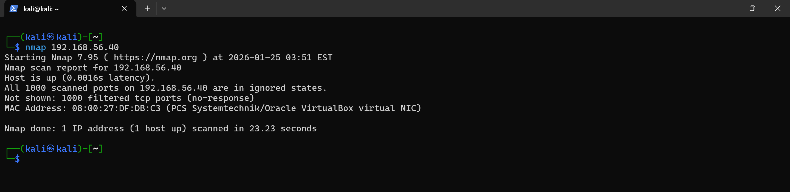
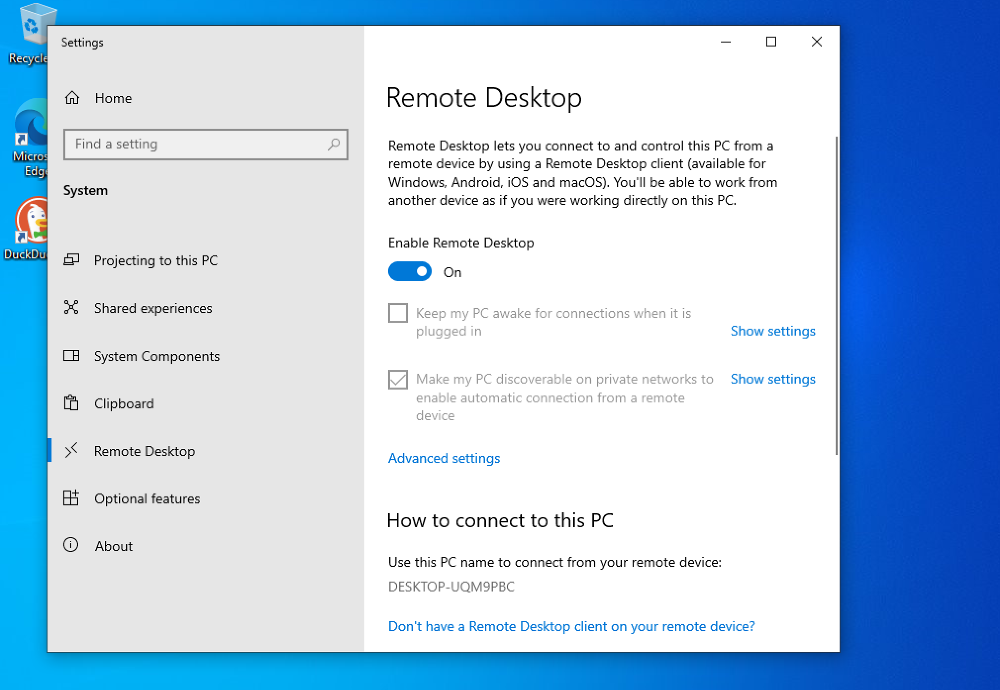
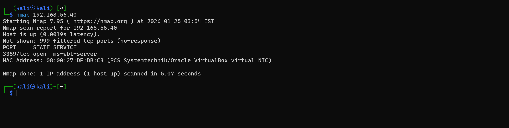
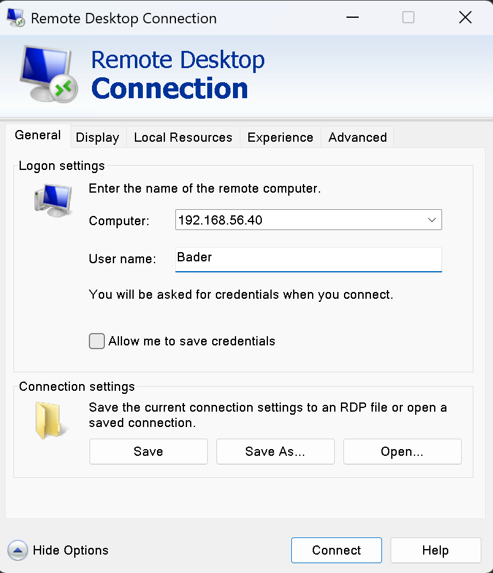
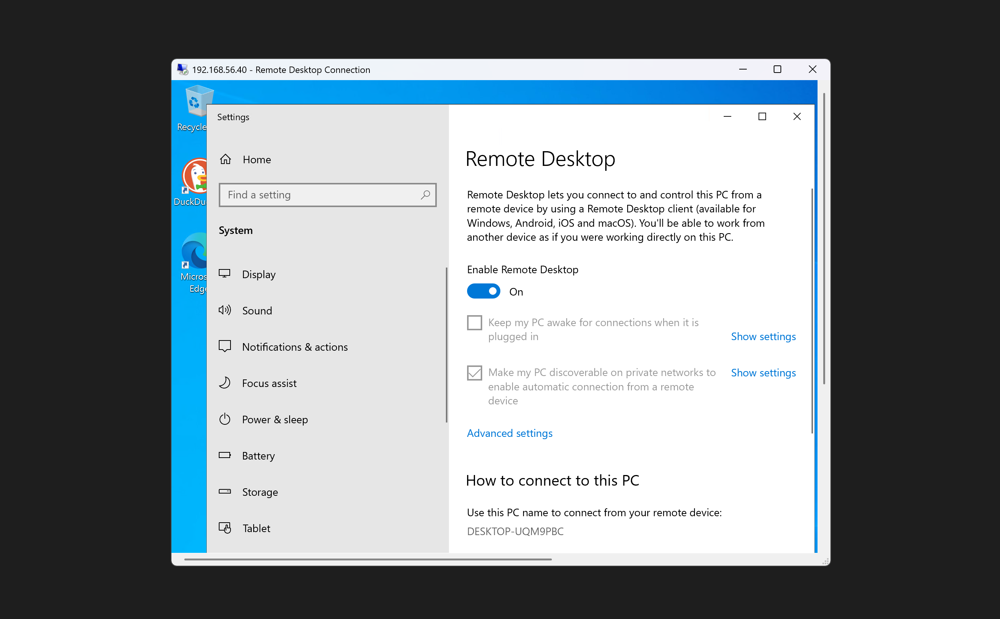
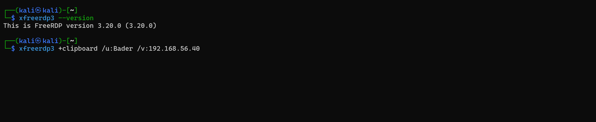

# Remote Access Attack Surface (RDP)

Enabled Remote Desktop on the Windows endpoint to introduce a real authentication-based attack surface. RDP was chosen because it's widely used in enterprise environments and heavily targeted in real-world attacks.

## Environment

| System  | Role     | IP Address     |
|---------|----------|----------------|
| Kali VM | Attacker | 192.168.56.10  |
| Win VM  | Target   | 192.168.56.40  |

Starting point: Phase 02 confirmed only scoped ICMP was allowed — no exposed TCP services.

---

## Steps

### 1. Pre-Exposure Port Scan

Scanned the Windows endpoint from Kali — no listening TCP services:

### 2. Enable Remote Desktop

Enabled RDP through Windows system settings:

### 3. Post-Exposure Port Scan

Repeated the same scan — port **3389/tcp** now open and identified as RDP:

### 4. RDP Validation — Windows Client (mstsc)

Connected via the built-in Remote Desktop client. Authentication succeeded, full interactive session established:

### 5. RDP Validation — Kali (xfreerdp)

Connected from Kali using `xfreerdp`, confirming the service is reachable and functional from an attacker-controlled system:

---

## Findings

| Check | Result |
|-------|--------|
| Pre-RDP scan | No exposed TCP services |
| Post-RDP scan | Port 3389 open |
| Windows client (mstsc) | Authenticated successfully |
| Kali client (xfreerdp) | Authenticated successfully |

Enabling RDP immediately expanded the attack surface from zero exposed services to an active authentication endpoint reachable by any system on the network. Authentication is now the primary security boundary.

---

## Next

With a real remote access service exposed, the next phase focuses on what happens when that entry point gets attacked — simulating brute-force attempts and analyzing how Windows logs authentication failures.
