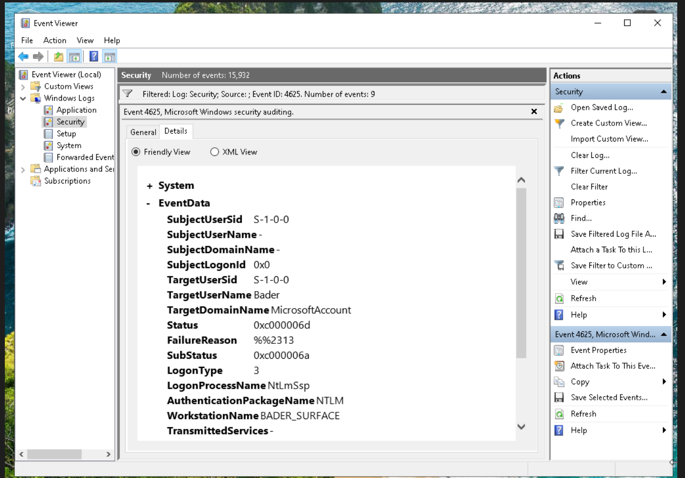
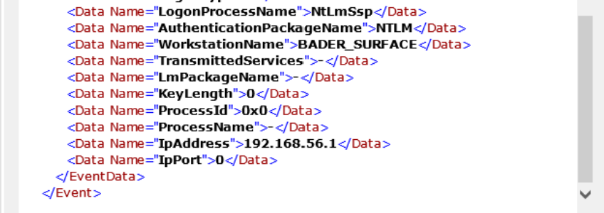
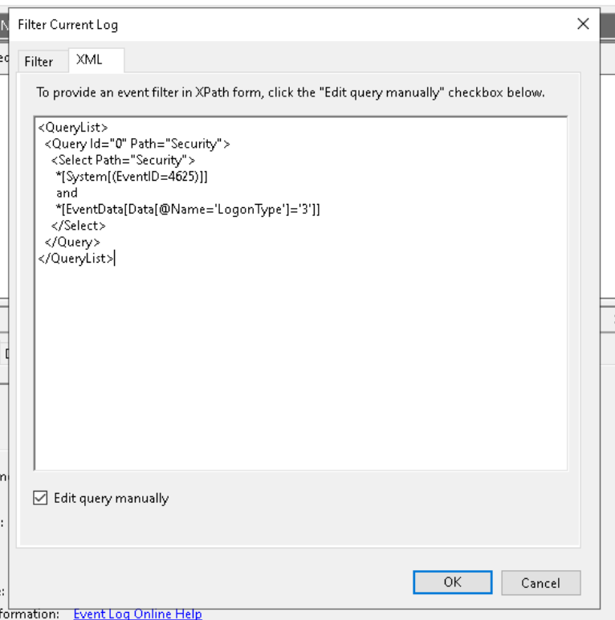
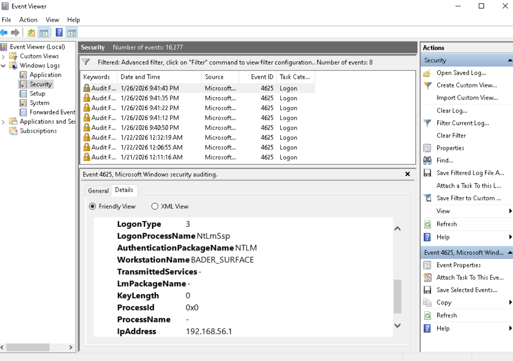
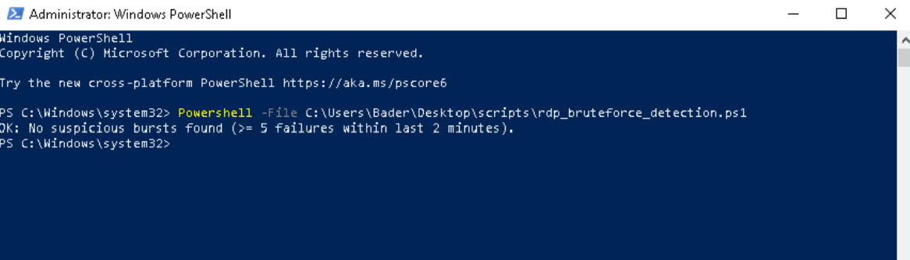
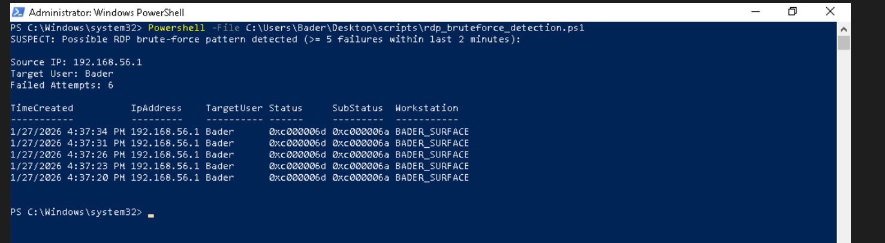

# RDP Authentication Failure Detection

Built a PowerShell detection script that monitors Windows Security logs for RDP brute-force patterns — filtering on Event ID 4625 (failed logon) with LogonType 3 (network), aggregating by source IP and target username within a time window.

**Detection Script:** [`rdp_bruteforce_detection.ps1`](scripts/rdp_bruteforce_detection.ps1)

## Environment

| System  | Role     | IP Address     |
|---------|----------|----------------|
| Kali VM | Attacker | 192.168.56.10  |
| Win VM  | Target   | 192.168.56.40  |

Starting point: Phase 03 confirmed RDP (port 3389) is exposed and accepting authentication.

---

## Understanding the Telemetry

Windows doesn't log "RDP attacks" directly — all authentication activity goes to the Security event log. The two relevant events are **4624** (successful logon) and **4625** (failed logon). Only 4625 matters for brute-force detection.

RDP authentication failures are recorded as **LogonType 3** (Network logon). Without filtering on this, detection would pick up local console failures, service account auth, and background system noise.

Each 4625 event contains the source IP address, target username, and workstation name — the fields needed for correlation:

---

## Isolating RDP Failures

Applied an advanced XML filter in Event Viewer to isolate only RDP-relevant failures: **Event ID 4625 + LogonType 3**.

Result — a clean, high-signal dataset with local login noise removed:

---

## Detection Logic

### Threshold

**5 failed attempts from the same source within 2 minutes.**

A human might mistype a password once or twice — automated attacks generate rapid, repeated failures. This threshold balances sensitivity with false-positive reduction and mirrors common SOC heuristics.

### What the Script Does

- Queries recent Event ID 4625 entries from the Security log
- Parses event XML to extract source IP, target username, and timestamps
- Filters for LogonType 3 only
- Aggregates failures by source IP and target user within the time window
- Flags any source exceeding the threshold

### Privilege Requirement

The Security log requires Administrator access. The script checks for elevation on launch and halts with a clear error if run without it: [run-script-not-elevated-error.png](evidence/run-script-not-elevated-error.png) · [add-administrator-requirement-clarity.png](evidence/add-administrator-requirement-clarity.png)

Execution policy was set to allow controlled script execution: [executionpolicy.png](evidence/executionpolicy.png)

---

## Validation

Ran the script as Administrator after generating intentional failed RDP login attempts from Kali:

Detection output — source IP, target account, failure count, and timestamps all captured:

Normal system behavior produced no alerts. Intentional brute-force activity was flagged correctly.

---

## Next

The detection logic works — failed RDP auth from a specific source is reliably identified. The next phase wires this into automated monitoring and alerting so the endpoint doesn't depend on someone manually running the script.
