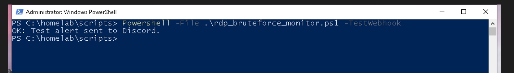
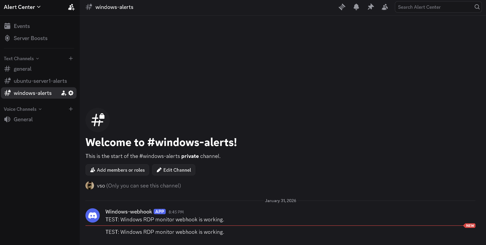
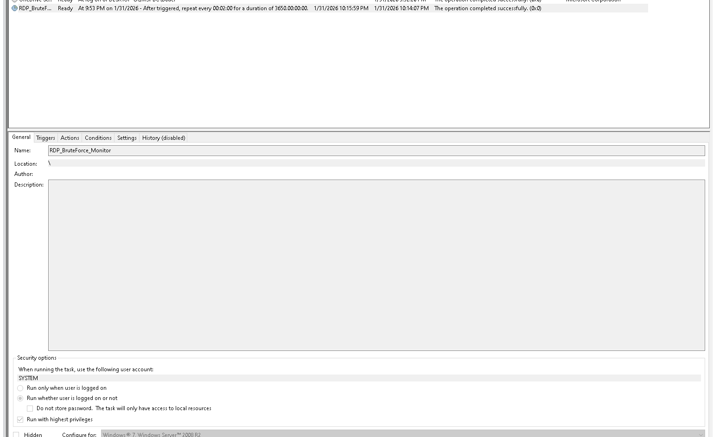
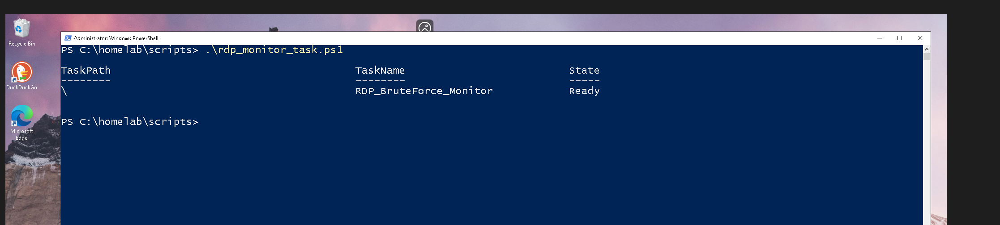
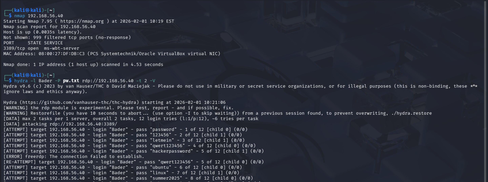
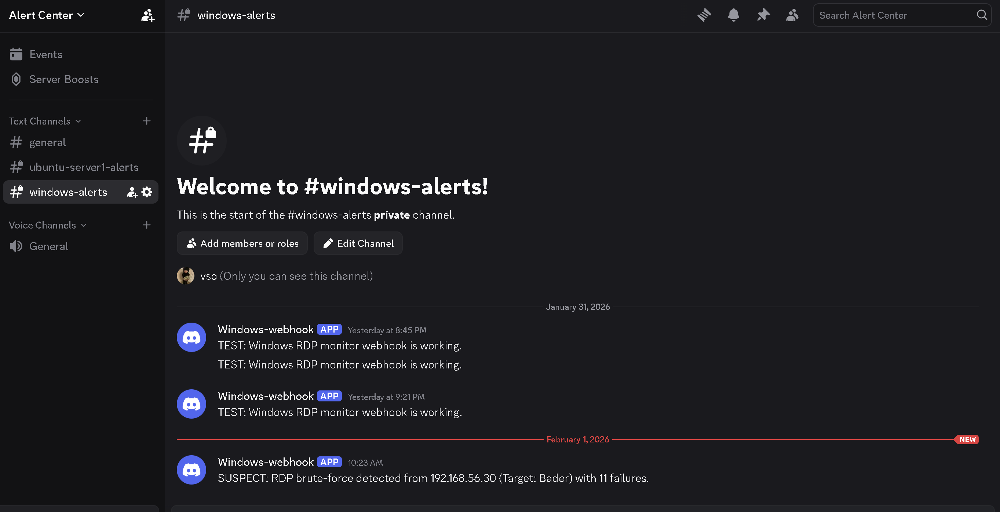
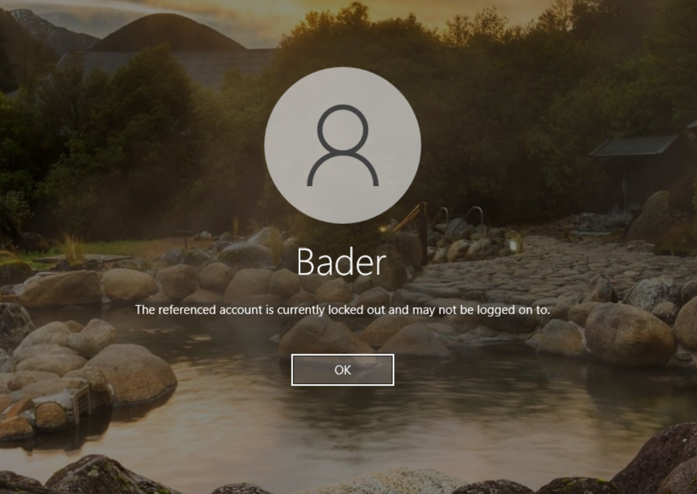

# Automated RDP Monitoring & Alerting

Automated the detection logic from Phase 04 into a continuous monitoring pipeline — the script runs on a recurring schedule via Task Scheduler, logs only suspicious activity, and delivers real-time alerts to a Discord webhook.

## Scripts

| Script | Purpose |
|--------|---------|
| [`rdp_bruteforce_monitor.ps1`](scripts/rdp_bruteforce_monitor.ps1) | Monitors Event ID 4625 for RDP brute-force patterns, logs findings, sends alerts |
| [`rdp_monitor_task.ps1`](scripts/rdp_monitor_task.ps1) | Registers the monitoring script as a scheduled task with elevated privileges |

## Environment

| System  | Role     | IP Address     |
|---------|----------|----------------|
| Kali VM | Attacker | 192.168.56.10  |
| Win VM  | Target   | 192.168.56.40  |

Starting point: Phase 04 validated the detection logic manually — this phase makes it run unattended.

---

## Webhook Alerting

Alerts are delivered to a Discord channel via webhook, simulating how enterprise SOCs forward events to Slack, Teams, or incident management platforms.

Tested webhook connectivity before enabling full monitoring:

### Secret Management

The webhook URL is stored in a separate secrets file, not embedded in the script. Default permissions were removed and access restricted to SYSTEM and Administrators only: [default permissions](evidence/webhook-url-default-file-permissions.png) · [remove inheritance](evidence/webhook-url-remove-inheritance-file-permission.png) · [final permissions](evidence/webhook-url-set-permissions-command-and-display-permissions.png)

---

## Task Scheduler Automation

The monitoring script runs on a recurring interval via Task Scheduler — highest privileges, independent of user logon state:

Manual execution to validate before leaving it on autopilot:

The script stays silent during normal operation — only writes to the log file when suspicious activity is detected or an execution error occurs.

---

## End-to-End Validation

### Controlled Brute-Force from Kali

Ran an nmap scan to confirm RDP exposure, then launched Hydra against a known account with a password list:

### Alert Delivered

The monitoring script detected the authentication failure burst and fired an alert — source IP, target account, and failure count all captured:

### Account Lockout Triggered

The repeated failures triggered Windows' built-in account lockout policy, temporarily locking the targeted account:

After recovery, RDP access was restored — confirming system stability post-lockout: [post-lockout RDP login](evidence/successful-rdp_suspect_logging-in-machine.png)

---

## Key Takeaway

The account lockout is worth noting — repeated authentication failures can cause denial of service to legitimate users even without successful compromise. This reinforces why early detection and alerting matter: you want to know about the attack *before* availability is impacted.

---

## Next

The monitoring pipeline detects and alerts on brute-force activity, but the endpoint still relies on Windows' built-in lockout as the only defense. The next phase introduces automated firewall-level response — blocking the attacker's IP before the lockout threshold is even reached.
