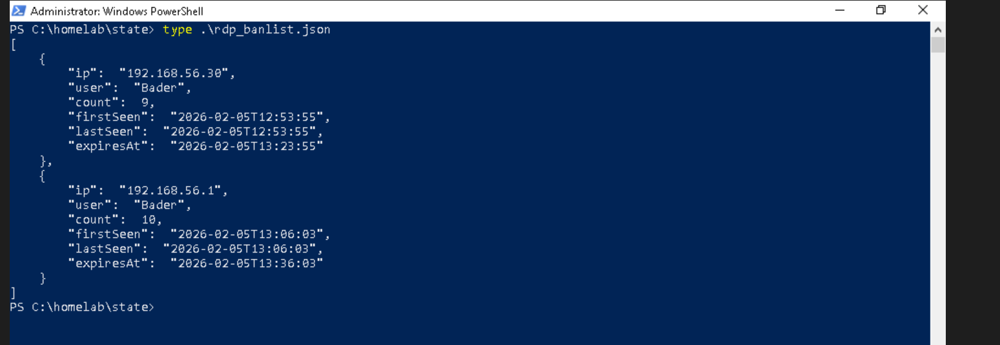
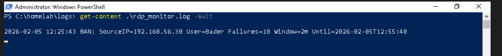
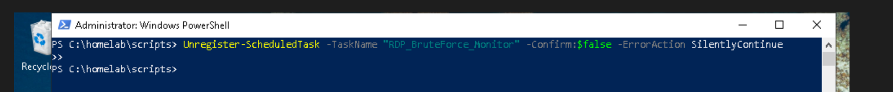
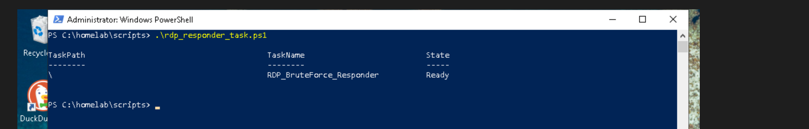
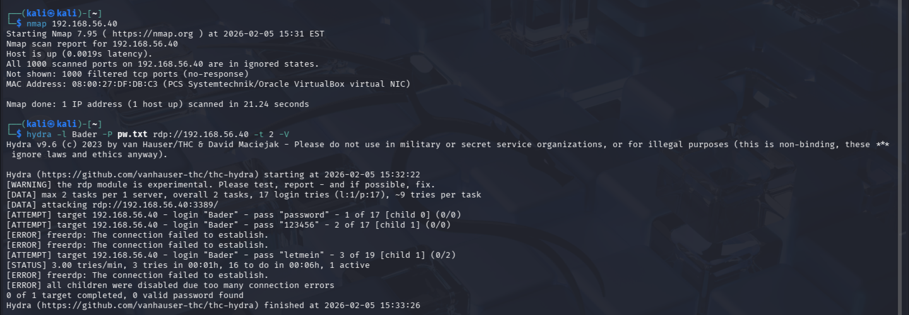
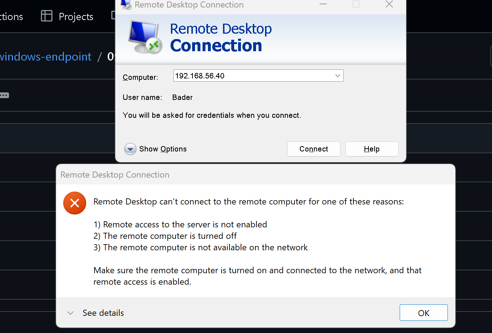
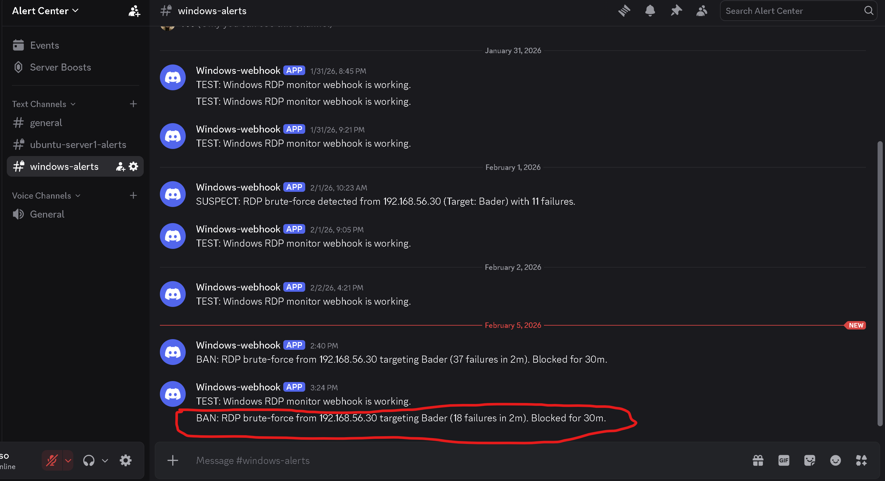

# Automated RDP Response & Containment

Moved from passive alerting to active containment — the responder script automatically detects RDP brute-force activity, creates a Windows Firewall rule blocking the attacker's IP, tracks bans with expiration in a persistent state file, and sends a real-time Discord alert.

## Scripts

| Script | Purpose |
|--------|---------|
| [`rdp_bruteforce_responder.ps1`](scripts/rdp_bruteforce_responder.ps1) | Detects RDP brute-force, enforces firewall bans, tracks state, sends alerts |
| [`rdp_responder_task.ps1`](scripts/rdp_responder_task.ps1) | Registers the responder as a scheduled task with elevated privileges |

## Environment

| System       | Role                | IP Address     |
|--------------|---------------------|----------------|
| Kali VM      | Attacker            | 192.168.56.30  |
| Win VM       | Target              | 192.168.56.40  |
| Host machine | Secondary attacker  | 192.168.56.1   |

Starting point: Phase 05 had automated monitoring and alerting — but alerting alone doesn't stop an attack.

---

## How the Responder Works

Each scheduled execution:

1. Queries recent Event ID 4625 failures (LogonType 3)
2. Checks if any source IP exceeds the threshold
3. Creates a Windows Firewall block rule for that IP
4. Records the ban in a persistent JSON state file with an expiration timestamp
5. Sends a Discord alert with attacker IP, target account, failure count, and ban duration

The state file prevents duplicate bans and handles automatic expiration without manual cleanup:

Successful ban enforcement logged locally:

---

## Task Scheduler Setup

Removed the previous monitoring-only task and registered the new responder task — runs on a recurring interval, highest privileges, no active session required:

Directories and files created automatically on first scheduled run: [auto-created files](evidence/directories-files-created-by-the-script-auto-run.png)

---

## Account Lockout Adjustment

Windows' built-in account lockout policy was temporarily increased during testing so the responder's firewall ban would trigger *before* the OS locked the account. This ensures containment is driven by the responder, not by default Windows behavior: [lockout threshold change](evidence/increase-account-lockout-threshold.png)

---

## Validation — Multi-Source Attacks

### Kali (Hydra)

After the responder triggered, Kali could no longer see RDP as open — Hydra failed at the network layer:

### Windows Host (mstsc)

RDP connection attempts from the banned host machine also blocked:

### Alert Delivered

Real-time Discord alert with full context — attacker IP, target account, failure count, time window, ban duration:

---

## Private IP Handling

The responder skips private and local IP ranges by default to prevent self-blocking: [skip logic](evidence/log-info-successfully-skipped-private-local-ip-ban-.png)

> **Lab note:** This exclusion was temporarily commented out during testing since both Kali and the host machine use private IPs. In production, these exclusions would remain enforced to protect internal infrastructure.

---

## Summary

This is the final phase of the lab. The Windows endpoint now operates with a complete security pipeline:

| Phase | Capability |
|-------|-----------|
| 01 – Baseline | Documented default security posture |
| 02 – Controlled Exposure | Validated firewall scoping with ICMP |
| 03 – Attack Surface | Exposed RDP, confirmed reachability |
| 04 – Detection | Built PowerShell detection for brute-force patterns |
| 05 – Monitoring & Alerting | Automated detection on a schedule with Discord alerts |
| 06 – Response | Automated firewall containment with persistent ban tracking |

The endpoint detects, alerts on, and actively blocks RDP brute-force attacks without human intervention.
