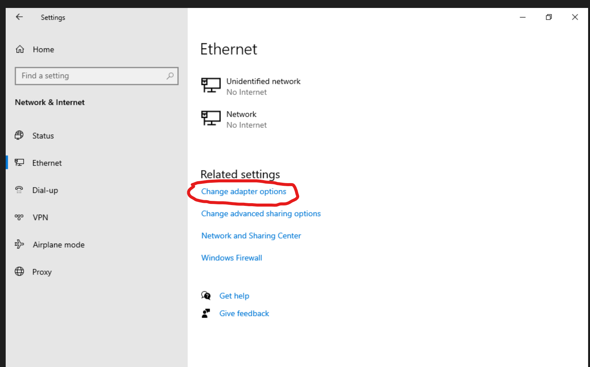
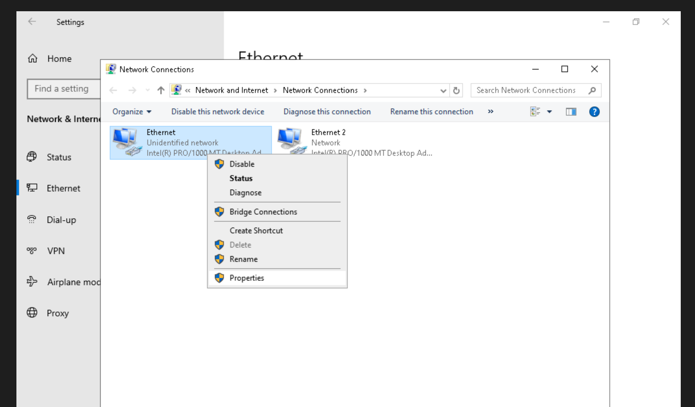
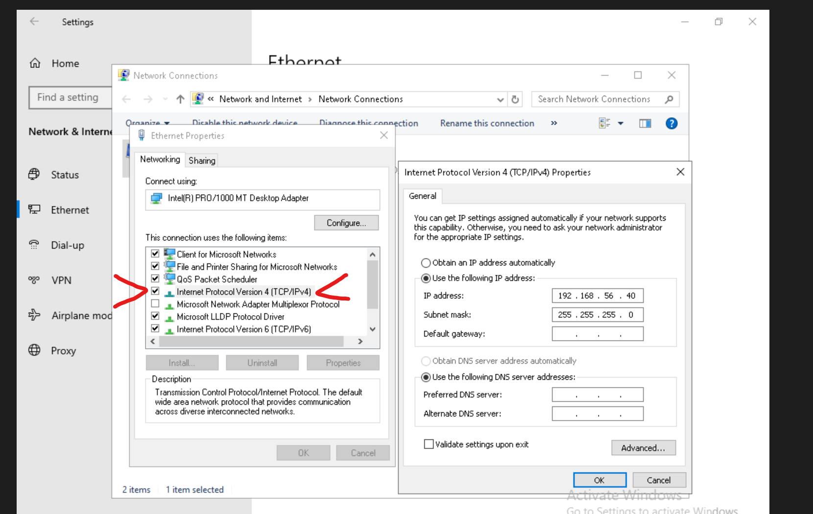
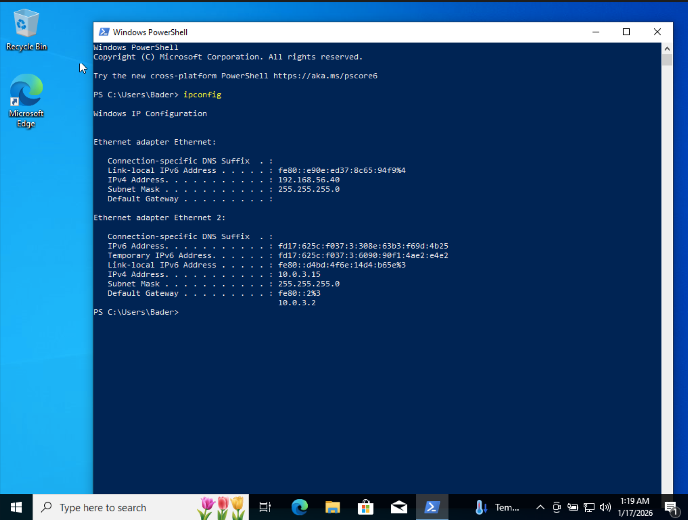

# Network Configuration — Windows Endpoint

The Windows VM uses **two network adapters** to separate internal lab traffic from internet access.

## Network Interface Overview

| Adapter    | Network Type | Purpose                      |
|------------|--------------|------------------------------|
| Ethernet   | Host-Only    | Internal lab communication   |
| Ethernet 2 | NAT          | Outbound internet access     |

---

## Host-Only Network (Internal)

**Subnet:** `192.168.56.0/24`

| Device     | Interface | IP Address     |
|------------|-----------|----------------|
| Windows VM | Ethernet  | 192.168.56.40  |

Static IP, no default gateway. Used for communication with Kali Linux, Ubuntu server, and host machine — not exposed to the internet.

---

## Static IP Configuration (Host-Only Adapter)

The Host-Only interface was manually configured to ensure predictable addressing and avoid conflicts with the NAT adapter.

### Step 1 — Open Network Adapter Settings

**Network & Internet → Ethernet → Change adapter options**

### Step 2 — Select the Host-Only Adapter

Right-click **Ethernet** (Host-Only) → **Properties**

### Step 3 — Configure IPv4 Manually

**Internet Protocol Version 4 (TCP/IPv4) → Properties → Use the following IP address:**

| Field          | Value           |
|----------------|-----------------|
| IP address     | `192.168.56.40` |
| Subnet mask    | `255.255.255.0` |
| Default gateway | *(none)*       |

---

## NAT Network (External)

IP assigned dynamically via VirtualBox NAT DHCP. Provides outbound internet access for updates and downloads — not used for lab communication or attack simulation.

---

## Verification

Confirmed both adapters are active with correct addressing:

